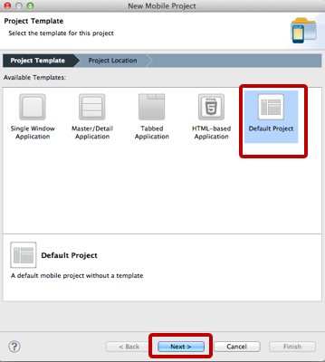
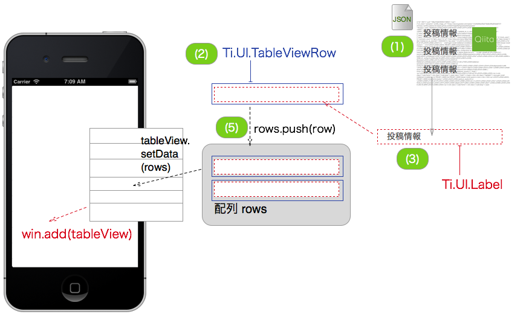
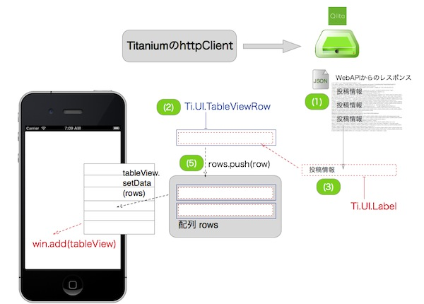

# TalbeViewを活用して情報を一覧表示する

## この章で学べること

iOS向けの特にニュースリーダー系のアプリケーションに採用されているユーザインタフェースとして、垂直方向にスクロールしながら情報を表示するようなものがあるかと思いますが、そういったユーザインタフェースを実現するための要素としてTableViewというものがあります。

この章ではTableViewを使ったiPhoneアプリの開発方法について学ぶことが出来ます

## 目次

- プロジェクトを設定する
- スマートフォン向けアプリでよくある一覧機能表示する機能についての解説
	- Titanium MobileのTableViewについて
	- 活用事例の紹介
- サンプルデータを使ってTableViewの使い方について学ぶ
- 取得したQiitaの投稿情報をTableViewを使って画面表示する
	- 取得した投稿情報のタイトルだけ表示する
	- 取得した投稿情報のタイトルとアイコン画像を表示する

## プロジェクトを設定する

TitaniumStudioを起動した後、File→New→Titanium Mobile Projectと進みます


Project Template画面が標示されたら、Default Projectを選択します



プロジェクト設定画面が表示されますので今回は以下入力してプロジェクトの設定を行います

- Project name: **tableView**
- App Id: **com.streetacademy.tableView**


しばらくすると設定が完了します


### スマートフォン向けアプリでよくある一覧機能表示する機能についての解説

一覧機能表示する機能としては、TableView というものがあるのでまずはその解説をします

#### Titanium MobileのTableViewについて

iOS向けの特にニュースリーダー系のアプリケーションに採用されているユーザインタフェースとして、垂直方向にスクロールしながら情報を表示するようなものがあるかと思いますが、そういったユーザインタフェースを実現するための要素としてTableViewというものがあります。

#### 活用事例の紹介

ニュースリーダー系のアプリケーションと言っても、イメージがつかない場合もあるかと思いますので、TableViewの活用事例について紹介します。
<table>
<th>TiQiitaの画面キャプチャ</th>
<th>CraftBeerFanの画面キャプチャ</th>
<tr>
<td>
<a href="../image/TiQiita-01.png" target="_blank"></a>
</td>
<td>
<a href="../image/CraftBeerFan-01.png" target="_blank"></a>
</td>
</tr>
<tr>
<td>
<a href="../image/TiQiita-02.png" target="_blank"></a>
</td>
<td>
<a href="../image/CraftBeerFan-02.png" target="_blank"></a>
</td>
</tr>
</table>

### サンプルデータを使ってTableViewの使い方について学ぶ

Titanium Mobileの標準APIであるhttpCLientを通じてQiitaの投稿情報を取得した後に、TableViewを使って画面に表示する機能を最初から作るとなると、理解が進まない可能性があるかと思います。

そこで、まずはあらかじめ準備してあるサンプルデータでのTableViewの使い方について説明します

これから実装する処理イメージとしては以下のようになります



サンプルデータは以下に準備してあるので、Webブラウザでダウンロードして、必ず現在開発中のTitanium MobileのプロジェクトのResourcesフォルダ直下に保存してください

[https://raw.github.com/h5y1m141/20130817-tistudy/master/sample.json](https://raw.github.com/h5y1m141/20130817-tistudy/master/sample.json)

保存が完了したら、以下要領で作業をします

1. 先ほどの **app.jsの中身のソースコードを全て削除**します。
2. その後に以下を記述します

```javascript
var sample, file, body, mainTable, win, i ,len ,row ,rows,textLabel;
// ダウンロードしたJSONファイルを読み込む処理
sample = Ti.Filesystem.getFile(Ti.Filesystem.resourcesDirectory, "sample.json");
file = sample.read().toString();
body = JSON.parse(file);

mainTable = Ti.UI.createTableView({
  width: 320,
  height:480,
  backgroundColor:"#fff",
  left: 0,
  top: 0
});
win = Ti.UI.createWindow({
  title:'QiitaViewer'
});
rows = []
for (i = 0, len = body.length; i < len; i++) { // (1)
  row = Ti.UI.createTableViewRow({	// (2)
    width: 'auto',
    height:40,
    borderWidth: 0,
	className:'entry',
    color:"#222"
  });
  textLabel = Ti.UI.createLabel({	// (3)
    width:'auto',
    height:30,
    top:5,
    left:5,
    color:'#222',
    font:{
      fontSize:16,
      fontWeight:'bold'
    },
    text:body[i].title
  });
  row.add(textLabel);		// (4)
  rows.push(row);			// (5)
}
mainTable.setData(rows);    // (6)
win.add(mainTable);
win.open();
```

1. body.lengthの値を確認することで投稿件数が確認できるので、その件数分ループして、投稿情報を１つづつ取り出していきます
2. 投稿情報の要素を格納するためにTableViewRowを生成します
3. 投稿情報のタイトル部分を格納するためにLabelを生成します
4. 上記で生成したLabelをTableViewRowに配置します
5. TableViewRowを配列rowsに挿入します
6. 投稿件数分のTableViewRowが配列rowsに格納されているので、その情報をTableViewに表示するために、setDataメソッドを使います

### 取得したQiitaの投稿情報をTableViewを使って画面表示する

Titanium Mobileの標準APIであるhttpCLientを活用して、Qiitaの投稿情報を取得する処理までは実装出来ましたので、今度は取得した情報を画面に表示する部分について解説します

#### 取得した投稿情報のタイトルだけ表示する

Qiitaの開発者向けのAPIを通じて投稿情報を取得した結果をTableViewを活用して表示する方法について解説します。

図にすると以下の様な処理になります。



以下のソースコードをサンプルに順次解説していきます。

```javascript
var xhr,qiitaURL,method,mainTable,win;
mainTable = Ti.UI.createTableView({
  width: 320,
  height:480,
  backgroundColor:"#fff",
  left: 0,
  top: 0
});
win = Ti.UI.createWindow({
  title:'QiitaViewer'
});

qiitaURL = "https://qiita.com/api/v1/items";
method = "GET";
xhr = Ti.Network.createHTTPClient();
xhr.open(method,qiitaURL);
xhr.onload = function(){
  var body,i ,len ,row ,rows,textLabel;
  if (this.status === 200) {
    body = JSON.parse(this.responseText);
    rows = [];
    for (i = 0, len = body.length; i < len; i++) { // (1)
      Ti.API.info(body[i].title);
      row = Ti.UI.createTableViewRow({	// (2)
        width: 'auto',
        height:40,
        borderWidth: 0,
		className:'entry',
        color:"#222"
      });
      textLabel = Ti.UI.createLabel({	// (3)
        width:'auto',
        height:30,
        top:5,
        left:5,
        color:'#222',
        font:{
          fontSize:16,
          fontWeight:'bold'
        },
        text:body[i].title
      });
      row.add(textLabel);		// (4)
      rows.push(row);			// (5)
    }
    mainTable.setData(rows);    // (6)
    win.add(mainTable);
    win.open();

  } else {
    Ti.API.info("error:status code is " + this.status);
  }
};
xhr.onerror = function(e) {
  var error;
  error = JSON.parse(this.responseText);
  Ti.API.info(error.error);
};

xhr.send();
```

1. body.lengthの値を確認することでWebAPIから取得した投稿件数が確認できるので、その件数分ループして、投稿情報を１つづつ取り出していきます
2. 投稿情報の要素を格納するためにTableViewRowを生成します
3. 投稿情報のタイトル部分を格納するためにLabelを生成します
4. 上記で生成したLabelをTableViewRowに配置します
5. TableViewRowを配列rowsに挿入します
6. WebAPIから取得した投稿件数分のTableViewRowが配列rowsに格納されているので、その情報をTableViewに表示するために、setDataメソッドを使います

上記をbuildして、iPhone、AndroidのEmulatorで表示した場合以下の様になります

<table>
<th>iPhone起動時の画面キャプチャ</th>
<th>Android起動時の画面キャプチャ</th>
<tr>
<td>
<a href="../image/qiitaviewer-httpClient-iphone-002.jpg" target="_blank"></a>
</td>
<td>
<a href="../image/qiitaviewer-httpClient-android-002.jpg" target="_blank"></a>
</tr>
</table>


#### 取得した投稿情報のタイトルとアイコン画像を表示する

先程は、タイトルのみ表示する方法について解説しましたが、タイトルだけではなく投稿したユーザのアイコンをTableViewを活用して表示する方法について解説します

図にすると以下の様な処理になります。


TableViewを使って投稿情報のタイトルと投稿したユーザのアイコンを表示するソースコード全体は以下になります

```javascript
var xhr,qiitaURL,method,mainTable,win;
mainTable = Ti.UI.createTableView({
  width: 320,
  height:480,
  backgroundColor:"#fff",
  left: 0,
  top: 0
});
win = Ti.UI.createWindow({
  title:'QiitaViewer'
});

qiitaURL = "https://qiita.com/api/v1/items";
method = "GET";
xhr = Ti.Network.createHTTPClient();
xhr.open(method,qiitaURL);
xhr.onload = function(){
  var body,i ,len ,row ,rows,textLabel,icon../Image,../imagePath;
  if (this.status === 200) {
    body = JSON.parse(this.responseText);
    rows = [];
    for (i = 0, len = body.length; i < len; i++) {
      row = Ti.UI.createTableViewRow({
        width: 'auto',
        height:60,
        borderWidth: 0,
		className:'entry',
        color:"#222"
      });
      textLabel = Ti.UI.createLabel({
        width:250,
        height:30,
        top:5,
        left:60,
        color:'#222',
        font:{
          fontSize:16,
          fontWeight:'bold'
        },
        text:body[i].title
      });
      ../imagePath = body[i].user.profile_../image_url;
      icon../Image = Ti.UI.create../ImageView({
        width:40,
        height:40,
        top:5,
        left:5,
        default../Image:"logo.png",
        ../image: ../imagePath
      });

      row.add(textLabel);
      row.add(icon../Image);
      rows.push(row);
    }
    mainTable.setData(rows);
    win.add(mainTable);
    win.open();

  } else {
    Ti.API.info("error:status code is " + this.status);
  }
};
xhr.onerror = function(e) {
  var error;
  error = JSON.parse(this.responseText);
  Ti.API.info(error.error);
};
xhr.timeout = 5000;
xhr.send();
```

上記ソースコードをbuildして、iPhone、AndroidのEmulatorで表示した場合以下の様になります

<table>
<th>iPhone起動時の画面キャプチャ</th>
<th>Android起動時の画面キャプチャ</th>
<tr>
<td>
<a href="../image/qiitaviewer-tableView-iphone-001.jpg" target="_blank"></a>
</td>
<td>
<a href="../image/qiitaviewer-tableView-android-001.jpg" target="_blank"></a>
</tr>
</table>


なお、投稿したユーザのアイコンを表示する時に１つ意識しておいたほうが良い部分があります。

今回のようなWebAPIを通じて画像を取得して表示するような場合、ネットワークの回線状況によってはすぐに標示されるとは限りません。

そのため、../ImageViewのdefault../Imageというプロパティに、あらかじめローカルに準備しておいた画像を指定することで、

1. 最初にローカルの画像が表示
2. 画像のダウンロード完了時に、ローカルの画像とリモートから取得した画像が入れ替わる

という処理が自動的にされるので、以下のようにTitaniumの../ImageViewのdefault../Imageのプロパティを適切に設定することをお勧めします

```javascript
// 一部抜粋
../imagePath = body[i].user.profile_../image_url;
icon../Image = Ti.UI.create../ImageView({
  width:40,
  height:40,
  top:5,
  left:5,
  default../Image:"logo.png",
  ../image: ../imagePath
});
row.add(icon../Image);
```


